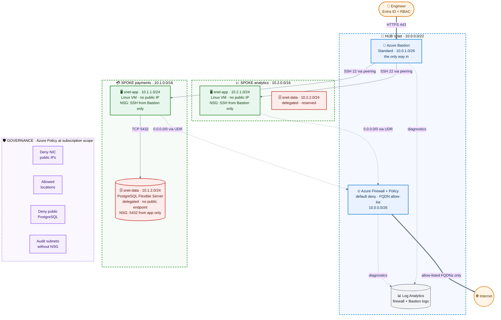

# Zero-Trust Azure Network (Terraform)


A hub-and-spoke network on Azure built entirely from reusable Terraform modules. Workloads and databases have no public IPs, the database sits in an isolated delegated subnet, and **Azure Bastion is the only way in**. Egress is forced through Azure Firewall and guardrails are enforced by Azure Policy.

Deployed to a live Azure subscription, verified with an automated test script, and torn down with `terraform destroy`.

## Architecture



More detail (traffic flows, address plan, design decisions, limitations): [docs/architecture.md](docs/architecture.md).

## Highlights

- **8 reusable modules** and **2 spokes**; adding a spoke is one map entry in `prod.tfvars`.
- **2 public IPs in the whole estate** (Firewall and Bastion). VMs and PostgreSQL have none.
- **Default-deny everywhere:** deny-all inbound NSG on every subnet, default-deny firewall egress, forced tunnelling via route tables.
- **4 Azure Policy guardrails** at subscription scope.
- **Self-checking:** `tests/verify-zero-trust.sh` asserts the zero-trust invariants against the live deployment.
- **Cost-aware:** firewall and Bastion can be switched off while iterating.

## What is in the repo

| Module | Purpose |
|---|---|
| `hub-network` | Hub VNet with `AzureFirewallSubnet` and `AzureBastionSubnet` |
| `firewall` | Azure Firewall Standard + policy (default deny, FQDN allow-list, DNS proxy, threat intel) + diagnostics |
| `bastion` | Bastion Standard with native-client tunnelling, shareable links off, diagnostics |
| `spoke-network` | Spoke VNet, per-subnet NSGs with deny-all inbound, forced-tunnel route table, hub peering |
| `workload-vm` | Ubuntu 24.04 VM, SSH key only, no public IP, managed identity |
| `postgres` | PostgreSQL Flexible Server, private access, private DNS zone, generated admin password |
| `monitoring` | Log Analytics workspace |
| `policy` | Subscription-scope Azure Policy assignments (built-in definitions) |

```
.
├── modules/            # the 8 reusable modules above
├── envs/prod/          # root module: wiring, variables, prod.tfvars
├── bootstrap/          # creates the remote-state storage account
├── scripts/connect.sh  # SSH to a spoke VM through Bastion
├── tests/verify-zero-trust.sh
├── docs/architecture.md
└── .github/workflows/terraform.yml
```

## Getting started

Prerequisites: Terraform 1.9 or newer, Azure CLI, `jq`, an Azure subscription, an SSH key (`ssh-keygen -t ed25519`).

```bash
az login
./bootstrap/state-backend.sh                 # remote state, writes envs/prod/backend.hcl

cd envs/prod
cat > secrets.auto.tfvars <<VARS
subscription_id = "<subscription-guid>"
ssh_public_key  = "$(cat ~/.ssh/id_ed25519.pub)"
VARS

terraform init -backend-config=backend.hcl
terraform plan  -var-file=prod.tfvars -out=tfplan
terraform apply tfplan
```

Then connect and verify:

```bash
./scripts/connect.sh payments                # SSH through Bastion (the only way in)
./tests/verify-zero-trust.sh                 # asserts the zero-trust invariants
```

### Cost and teardown

Azure Firewall and Bastion Standard bill hourly and dominate the cost. Deploy in two passes: first with `-var enable_firewall=false -var enable_bastion=false` to build and test everything else cheaply, then add them. Always tear down with `terraform destroy -var-file=prod.tfvars`, not from the portal, so state and the subscription-level policy assignments are cleaned up together.

## Proofs
Recource Groups:-

Recources:-


Apply completed status:-

Verifying Zero trust:-

Log analytics workspace:-


## CI/CD

`.github/workflows/terraform.yml` runs `terraform fmt`, `validate`, `tflint` and `checkov` on every push and pull request. The `plan` and `apply` jobs authenticate to Azure with OIDC (no stored secrets), and `apply` waits for manual approval on the `production` environment. Those two jobs are gated behind the repository variable `DEPLOY_ENABLED`, because a deployment costs money; the deployment shown above was run manually from the command line.

## Lessons learned

- **State backend permissions lag.** A new role assignment on the state storage account took several minutes to work, and `init` failed with a 403 until it did.
- **A network drop mid-apply leaves orphans.** Resources were created in Azure but never saved to state; recovered with `terraform import` and a re-apply.
- **Never delete from the portal.** It desynchronises state, and subscription-scope policy assignments survive a resource group deletion. Use `terraform destroy`.

## Limitations and roadmap

Known limitations are listed in [docs/architecture.md](docs/architecture.md#known-limitations). Not built yet: Key Vault with a private endpoint for secrets, VNet flow logs with Traffic Analytics, Sentinel analytics rules, Firewall Premium, a second-region hub, a `terraform test` suite and Infracost in pull requests.

