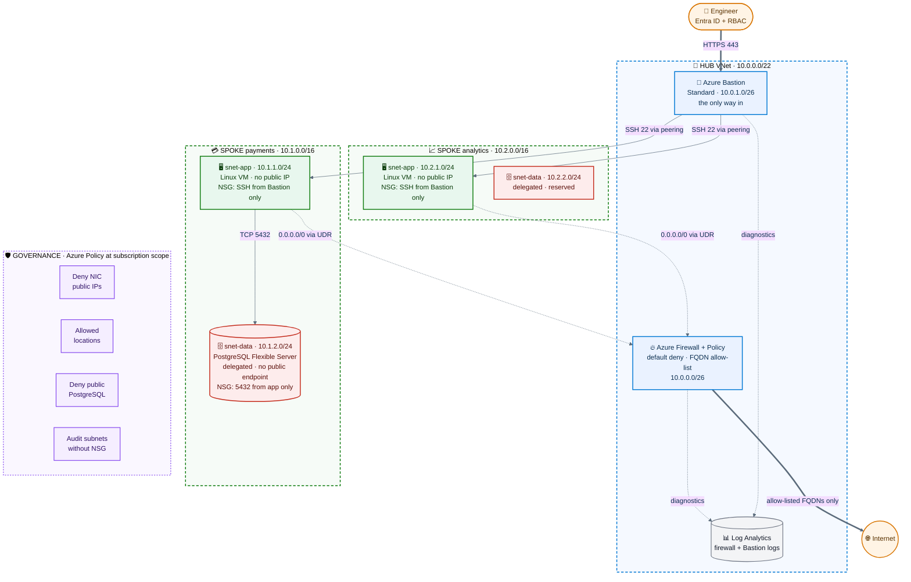
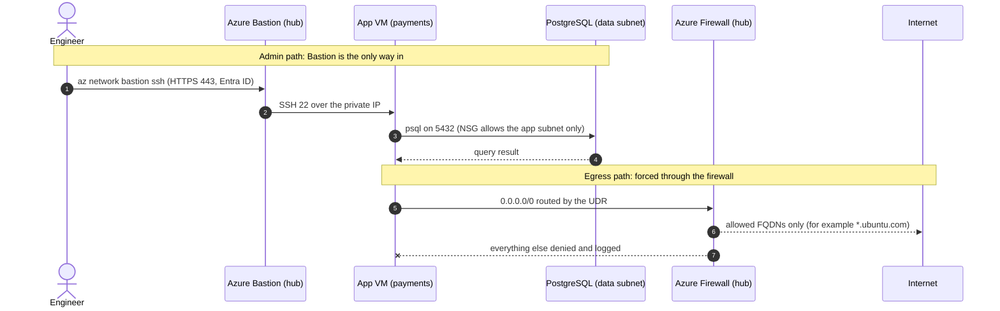
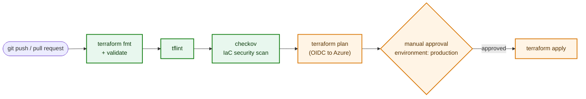

# Architecture

Hub-and-spoke network on Azure, defined entirely in Terraform. Everything is private by default: the only public IPs in the estate belong to Azure Firewall and Azure Bastion.

## Topology

**How to read it:** thick arrows are the only paths that cross the internet boundary, dashed arrows are routing and telemetry, and green/red/blue nodes are workloads, data and shared network services.

## Traffic flows

## Address plan

| Network | CIDR | Subnets |
|---|---|---|
| Hub | `10.0.0.0/22` | `AzureFirewallSubnet` 10.0.0.0/26, `AzureBastionSubnet` 10.0.1.0/26 |
| Spoke: payments | `10.1.0.0/16` | `snet-app` 10.1.1.0/24, `snet-data` 10.1.2.0/24 (PostgreSQL, delegated) |
| Spoke: analytics | `10.2.0.0/16` | `snet-app` 10.2.1.0/24, `snet-data` 10.2.2.0/24 (delegated, no database deployed) |

Adding a spoke is one more entry in `spokes` in `envs/prod/prod.tfvars`.

## Zero-trust controls

| Control | Where | What it enforces |
|---|---|---|
| Single entry point | `modules/bastion` | The only public ingress is Bastion over 443; VMs and the database have no public IP |
| Explicit deny-all inbound | `modules/spoke-network` | A priority 4096 rule per subnet overrides the default `AllowVnetInBound`, so peered networks are not implicitly trusted |
| Least-privilege allow rules | `envs/prod/prod.tfvars` | App accepts SSH only from the Bastion subnet; data accepts 5432 only from the app subnet |
| Forced tunnelling | `modules/spoke-network` | `0.0.0.0/0` goes to the firewall; `default_outbound_access_enabled = false` removes implicit egress |
| Egress allow-list | `modules/firewall` | Firewall denies by default; only listed FQDNs pass; threat-intel mode `Deny` |
| Isolated data tier | `modules/postgres` | VNet-integrated PostgreSQL in a delegated subnet, `public_network_access_enabled = false`, private DNS zone |
| Spoke-to-spoke isolation | peering design | Spokes peer only with the hub, so cross-spoke traffic must pass the firewall |
| Guardrails | `modules/policy` | Azure Policy denies NIC public IPs, off-region deployments and public PostgreSQL, and audits subnets without an NSG |
| Visibility | `modules/monitoring` | Firewall and Bastion logs land in Log Analytics |

## Design decisions

- **Bastion Standard, not Basic:** native-client tunnelling (`az network bastion ssh`) and reach into peered VNets.
- **Delegated subnet instead of a private endpoint for PostgreSQL:** the server gets a private IP inside the data subnet, so the NSG on that subnet directly controls who can connect, and no public endpoint exists at all.
- **Firewall Standard with FQDN rules:** enough to demonstrate default-deny egress; Premium (TLS inspection, IDPS) is on the roadmap.
- **One NSG per subnet, generated from data:** rules live in `tfvars`, so a reviewer can read the whole security posture in one file.
- **Two-pass deployment for cost:** `enable_firewall` and `enable_bastion` switches let the network, VMs and database be built and tested before the hourly-billed services are added.

## CI/CD pipeline

Green stages run on every push and pull request without cloud credentials. The orange stages need Azure OIDC credentials and run only when the repository variable `DEPLOY_ENABLED` is `true`.

## Known limitations

- Traffic inside one spoke (app to data) uses the VNet system route and is controlled by NSGs, not the firewall.
- The PostgreSQL delegated subnet skips the firewall route and outbound deny, to avoid breaking platform management traffic. Isolation there comes from delegation, no public endpoint and the inbound NSG.
- The Bastion subnet has no NSG yet (Azure requires a specific rule set).
- The database admin password is generated by Terraform and lives in encrypted remote state. Moving it to Key Vault is on the roadmap.
